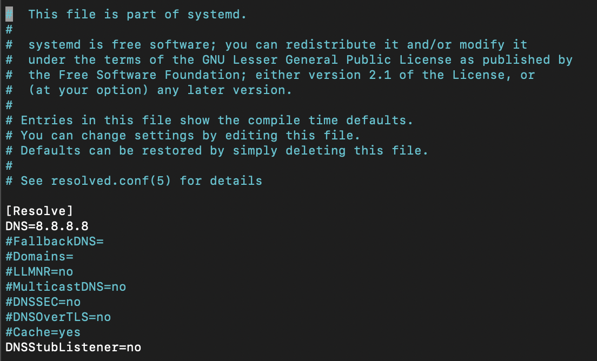

# 安装

**wifipumpkin3**使用python3编写，你需要在机器上部署Python运行环境（**3.7或更新的版本**）来运行它。

注意：

* **Window**系统不被支持。
* **Mac OS X**系统不被支持。只存在**Docker**版本，但是没被测试过。

## 必备条件

你需要一个支持 **Access-Point \(AP\)** 模式的Wi-Fi设备。以下系统列表是推荐用于运行wifipumpkin3的环境，因为在这些系统中，大多数必须的依赖项都是预安装的。也推荐使用VM和Docker来进行部署。

**工具（预安装）**

* iptables \(current: iptables v1.6.1\)
* iw \(current: iw version 4.14\)
* net-tools \(current: version \(1.60+\)
* wireless-tools \(current: version 30~pre9-12\)
* hostapd \(current: hostapd v2.6\)

**操作系统（推荐）**

| OS | Version |
| :--- | :--- |
| Ubuntu | 18.04 LTS bionic |
| Docker | Ubuntu 18.04.4 LTS bionic |

## 基于Debian程序

wifipumpkin3使用53端口部署python dns服务，当我尝试在Ubuntu 18.04上安装时，我收到了因为“53端口已经被其他进程占用”的报错。这个问题时由systemd-resolved服务导致的，并可以通过以下步骤来解决。

1. 停止systemd-resolved "`sudo systemctl stop systemd-resolved`"
2. 如下图所示编辑 `/etc/systemd/resolved.conf`



3.并且执行链接文件

```text
sudo ln -sf /run/systemd/resolve/resolv.conf /etc/resolv.conf
```


修复完成！参考：  [Nitin Gurbani](https://medium.com/@niktrix/getting-rid-of-systemd-resolved-consuming-port-53-605f0234f32f)

## 安装步骤

如果你的机器上安装有python3.7或更新的版本，安装Wp3将会非常简单。请按照以下步骤进行：

### Debian/Ubuntu

强烈建议安装一些系统包和操作系统级依赖项

```text
sudo apt install python3.7-dev libssl-dev libffi-dev build-essential python3.7
```

```text
 $ git clone https://github.com/P0cL4bs/wifipumpkin3.git
 $ cd wifipumpkin3
 $ sudo make install
```

或者从GitHub [Releases](https://github.com/P0cL4bs/wifipumpkin3/releases) 页面获取Debian `*.deb` 包

```text
$ sudo dpkg -i wifipumpkin3-1.0.0-all.deb 
```

### 在Kali Linux上进行安装

Kali Linux默认安装了与`wp3`兼容的**python3.8，**我推荐安装一些系统包和操作系统级依赖项，

```text
$ sudo apt install libssl-dev libffi-dev build-essential
$ git clone https://github.com/P0cL4bs/wifipumpkin3.git
$ cd wifipumpkin3
```

现在，我们需要安装`PyQt5`, 这很容易：

```text
sudo apt install python3-pyqt5
```

检查pyqt5安装情况：

```text
python3 -c "from PyQt5.QtCore import QSettings; print('done')"
```

现在，如果你获得了回显信息`done`，非常好，下一步安装`wp3`

```text
$ sudo python3 setup.py install
```

如果你看到了如下信息，安装成功！

> Finished processing dependencies for wifipumpkin3==1.0.0

现在，我们启动应用：

```text
$ sudo  wifipumpkin3
```

一切就绪后，就可以看到`wp3`的CLI

**安装Python virtualenv**

virtualenv是一个用于创建隔离Python环境的工具。它是最简单和最推荐的方式去配置自定义的Python环境。

> **PyQt5的版本**
>
> 需要将requirements.txt中的QT5安装版本从`PyQt5==5.14.0` 更改为 `PyQt5==5.14.2`
>
> 5.14.2版本的QT5可以在virtualenv中无Python依赖错误下运行.

```text
$ sudo python3.7 -m pip install --upgrade pip
$ git clone https://github.com/P0cL4bs/wifipumpkin3.git
$ cd wifipumpkin3
$ sudo python3.7 -m pip install virtualenv
```

现在，你需要在超级用户`root`下运行：

```text
# virtualenv -p python3.7 venv
# source venv/bin/activate
# make install_env
```

如果你看到了如下信息，说明安装成功！

> Finished processing dependencies for wifipumpkin3==1.0.0

现在，让我们启动应用：

```text
# wifipumpkin3
```

一切就绪后，将在激活的virtualenv上看到wp3的CLI窗口。

当在虚拟环境中的工作结束后，你可以通过运行如下语句来终止

```text
# deactivate
```

### **在Docker容器中安装**

Docker是一个可用于开发、发布、运行应用程序的开放的平台。它使你可以将应用程序与支持环境分离，以便快速交付软件。`wp3`完全兼容于运行于docker平台。让我们开始吧：

> [https://docs.docker.com/get-docker/](https://docs.docker.com/get-docker/)

当docker.io安装完毕并能运行良好后，让我们看看如何为`wp3`配置容器。

```text
$ git clone https://github.com/P0cL4bs/wifipumpkin3.git
$ cd wifipumpkin3
$ sudo docker build -t "wifipumpkin3" .
```

以上命令将为我们下载并建立一个新的容器叫`wifipumpkin3`，你将看到Docker逐步完成Dockerfile中的每一条指令，并在此过程中构建你的映像。如果搭建成功，生成过程将以以下信息结束：

> Successfully tagged wifipumpkin3

现在你需要运行你的映像作为一个容器，使用你的新映像启动一个容器：

```text
$ sudo docker run --privileged -ti --rm --name wifipumpkin3 --net host "wifipumpkin3" 
```

一切就绪，将在激活的docker上看到wp3的CLI

**在Docker-compose上安装**

你可以使用`docker-compose.yml`来进行`wp3`的安装。通过以下步骤简单的搭建映像运行。

```text
$ docker-compose build wifipumpkin3
```

运行容器

```text
$ sudo docker-compose run wifipumpkin3 wifipumpkin3
```

使用pulp文件来运行容器

```text
$ sudo docker-compose run wifipumpkin3 wifipumpkin3 --pulp scripts/demo.pulp
```

一切就绪，将在激活的docker上看到wp3的CLI。感谢 [@rafonsecad](https://github.com/rafonsecad)

### 关于无线网卡

你的无线网卡和内核驱动必须支持AP模式。可以通过以下命令来检查：

```text
iw list
```

如果在“Supported interface modes”列表中存在‘AP’，你的设备就支持所需的模式。

其他方法：

* 通过以下命令找到查看正在使用的内核驱动程序模块：

```text
lspci -k | grep -A 3 -i network
```

（示例模块：ath9k）接下来，使用以下命令查看你的wifi功能（将ath9k替换为你的内核驱动）

```text
modinfo ath9k | grep depend
```

如果以上输出包含"mac80211"，则表示你的wifi设备支持AP模式。

所用的适配器需要有GNU/Linux的驱动程序。

* 列出支持设备的网站 [here](http://elinux.org/RPi_USB_Wi-Fi_Adapters)
* 检测内核驱动   [wireless.wiki](https://wireless.wiki.kernel.org/en/users/drivers)

